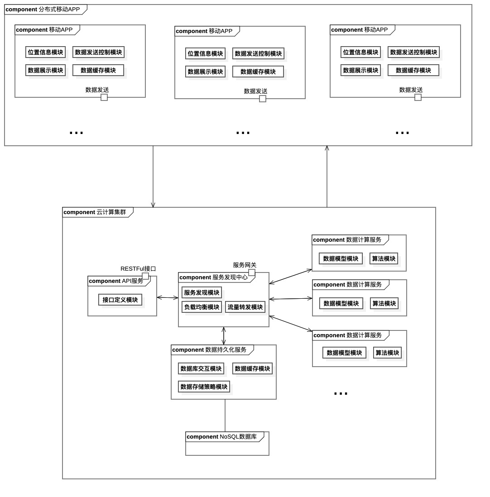

<!--
 *  ┌───┐   ┌───┬───┬───┬───┐ ┌───┬───┬───┬───┐ ┌───┬───┬───┬───┐ ┌───┬───┬───┐
 *  │Esc│   │ F1│ F2│ F3│ F4│ │ F5│ F6│ F7│ F8│ │ F9│F10│F11│F12│ │P/S│S L│P/B│  ┌┐    ┌┐    ┌┐
 *  └───┘   └───┴───┴───┴───┘ └───┴───┴───┴───┘ └───┴───┴───┴───┘ └───┴───┴───┘  └┘    └┘    └┘
 *  ┌───┬───┬───┬───┬───┬───┬───┬───┬───┬───┬───┬───┬───┬───────┐ ┌───┬───┬───┐ ┌───┬───┬───┬───┐
 *  │~ `│! 1│@ 2│# 3│$ 4│% 5│^ 6│& 7│* 8│( 9│) 0│_ -│+ =│ BacSp │ │Ins│Hom│PUp│ │N L│ / │ * │ - │
 *  ├───┴─┬─┴─┬─┴─┬─┴─┬─┴─┬─┴─┬─┴─┬─┴─┬─┴─┬─┴─┬─┴─┬─┴─┬─┴─┬─────┤ ├───┼───┼───┤ ├───┼───┼───┼───┤
 *  │ Tab │ Q │ W │ E │ R │ T │ Y │ U │ I │ O │ P │{ [│} ]│ | \ │ │Del│End│PDn│ │ 7 │ 8 │ 9 │   │
 *  ├─────┴┬──┴┬──┴┬──┴┬──┴┬──┴┬──┴┬──┴┬──┴┬──┴┬──┴┬──┴┬──┴─────┤ └───┴───┴───┘ ├───┼───┼───┤ + │
 *  │ Caps │ A │ S │ D │ F │ G │ H │ J │ K │ L │: ;│" '│ Enter  │               │ 4 │ 5 │ 6 │   │
 *  ├──────┴─┬─┴─┬─┴─┬─┴─┬─┴─┬─┴─┬─┴─┬─┴─┬─┴─┬─┴─┬─┴─┬─┴────────┤     ┌───┐     ├───┼───┼───┼───┤
 *  │ Shift  │ Z │ X │ C │ V │ B │ N │ M │< ,│> .│? /│  Shift   │     │ ↑ │     │ 1 │ 2 │ 3 │   │
 *  ├─────┬──┴─┬─┴──┬┴───┴───┴───┴───┴───┴──┬┴───┼───┴┬────┬────┤ ┌───┼───┼───┐ ├───┴───┼───┤ E││
 *  │ Ctrl│    │Alt │         Space         │ Alt│    │    │Ctrl│ │ ← │ ↓ │ → │ │   0   │ . │←─┘│
 *  └─────┴────┴────┴───────────────────────┴────┴────┴────┴────┘ └───┴───┴───┘ └───────┴───┴───┘
 -->


# 基于移动边缘计算的分布式众包道路流量监测解决方案｜第二版（大纲）

## 综述

1. 改善传统道路监测模式的弊端：高成本的路网监测系统搭建。
2. 本项目融合了**众包**的思想，从用户的移动设备提取位置信息，克服传统监测系统模式的弊端。
3. 为有道路监测需求的机关部门提供一种高可用、高实时、低成本的道路流量监测解决方案。
4. 为市民日常出行的拥堵问题，提供解决方案。
***
## 空间模型

## 计算模型
   ### 模型
   根据[Wardrop的匀质离散型交通流模型]()为基础的**区间**匀速估计方法  
   >see [Model](./Model_Iteration.md)
   
   **Summary:**  
1. 计算**各子交通流**出现的概率
2. 计算路段的速度期望值
3. 计算路段的拥堵程度（期望速度与绿波标准速度的比值）

  <font size='4'>$\bar{u}_s=E(u_{s}) =\sum_{1}^{C}u_ip_s(i)=
  \\
  \sum_{1}^{C}\frac{u_ik_i}{k}
 =\sum^{C}_{1}q_i/k
 \\
 = q/k\\
\varepsilon=\bar \frac{u_s}{u}$
</font>

4. 后台系统发送代码  

| 代码 | 拥堵系数 | 描述 |
| :-----| ----: | :----: |
|**00:**|$\varepsilon >1$|道路通畅|
| **01** |$\varepsilon <1$|  轻微拥堵 |
|   **10**|$\varepsilon <1$| 中度拥堵 |
|   **11**|$\varepsilon <1$| 严重拥堵|  
*亟待导入$\varepsilon$具体数值


**已知的问题：**
1. 不考虑交通事故等因素等情况，**样本点集中于某一测速点或测速点外**导致描述性较差（样本点数据不能代表整条路段数据）
2. 跟驰模型、司机变道行为等尚未加入考虑范围，导致系统鲁棒性可能不足
3. 方向问题

***

## 问题解决：  
### 问题2: 
   >对于问题2，上述模型的问题在于，若是用设置观测点的形式测瞬时速度，难免出现样本集中的问题
### 解决方案
   1. 用计时方式发送，系统**每隔一段时间**进行
      1. 速度测算
      2. 按速度筛分子交通流
      3. 计算路段平均速度
      4. 计算路段拥堵状况
   2. 方案的核心在于，找出合适的**时间间隔**
      1. **于此，将查阅一些论文文献后，再进行方案更深入的探讨**
   3. DBSCAN 基于密度的聚类算法 [Implementation of DBSCAN](https://www.cnblogs.com/zhangchaoyang/articles/2182748.html)
   
   通过该算法可以筛除聚集点区域多余的点
   

### 问题3:

- 给出系统计算上，对于方向数据的**识别与处理**方式
- 亟待讨论

***

## 过程-1
### 流量测算
1. 数据结构-输入
   ```
   position: GPS数据{ 
       road_id: 道路id,
       longitude： 经度,
       latitude: 纬度,
       velocity: 瞬时速度,
       direction_angle: 方向角度,
       accuracy: 定位精度
   }
   ```
2. 算法描述

   1. 预处理区域路网 - 0.0.1
      1. 定义区域矩阵 A , 将地图经纬度映射到一个n*n*5矩阵上
         1. 矩阵的三层分别是
            1. 经度
            2. 纬度
            3. 速度（初始为0）
            4. 方向 (初始00)
            5. 道路id

>tip:开发时，不妨采用hashmap，将经纬度合并计算hashkey，将速度、方向、道路id作为 value vector

   2. 处理信息-0.0.2
      1. 输入(GPS数据)
      2. 筛选数据
         1. **if** 精度距离大于**阈值**，将其丢弃
         2. **if** 经纬度超出矩阵范围，丢弃
         3. **else** 进入 下一步
      3. 处理方向数据
         1. 读入方向角度
         2. 判断方向角度的范围
         3. 根据范围给出方向编码 (00北，01东，10西，11南)
      4. 速度，方向 根据经纬度的hashkey填入矩阵
      5. 经过一层DBSCAN筛除聚密度噪点
      6. 找到**道路id一致**且**速度方向一致**的value vector
      7. 根据**模型**计算拥堵系数
      8. 根据拥堵系数给出拥堵代码

   3. 返回信息
   ```
      response返回数据{
         road_id: 道路id,
         jam_scale: 拥堵代码
      }

   ```

***

## 系统构架
1. 系统整体采用**C-S模式**的架构
2. 客户端基于移动app的**数据采集**和**数据展示**
3. 服务端采用**微服务架构**，目的如下：
   1. 对于系统**解耦**，提高开发效率
   2. 提高系统整体的性能
   3. 方便以分布式的方式部署，降低服务架设的成本
4. 整体架构展示图
   ***
   
   ***
## 移动APP集群
1. 位置信息模块：
   1. 基于外部高德SDK的地图与定位服务调用
   2. 在基本位置信息的基础上，~~提供区块划分的数据服务功能~~（亟待讨论）
  
2. 数据展示模块：
   1. **若无必要，勿增实体**：  
   为用户展示以**用户**为中心，特定半径的圆形区域内的区域（Radar）拥堵状况。
   ~~以用户行进方向为基准，为用户展示前方**视距（Visual）内的**节点关联的路况（基于**图模型**）~~
   
   2. 提供某区域整体路况（亟待讨论）
3. 数据发送控制模块：
   1. 控制用户设备的数据发送间隔，以控制服务端**负载**
   2. 控制app对于移动设备的性能占用
4. 数据缓存模块：
   1. 以提高用户体验为主，降低用户对于数据展示的等待时间
   
## 服务端
1. API服务
   1. 遵循**RESTFul**标准格式，确保第三方接入的可靠性
   2. 提供详尽的**接口文档**
   3. 用例驱动，**减少冗余**的接口设计
   4. 为API分级，减少破坏性开发过程的出现
   5. **开发前务必与前端商讨好接口格式**
2. SOA
   1. 服务注册发现，微服务的核心调度（Netflix Eureka）
   2. 负载均衡，提高并发，提高系统整体效能
   3. 服务熔断（Hystrix）、降级等非业务化的提高**可用性**的服务模块
   4. 消息队列（以后可能的邮件短信服务）等
   5. 分布式的日志解决方案，降低运维成本
3. 持久化
   1. 采用缓存策略，提高系统整体可用性、并发性。
   2. 采用**NoSQL数据库** 进行存储。
      1. 由于采用分布式系统，的缘故，传统关系型数据库的ACID事务管理对数据的存储效率产生**瓶颈**和不稳定因素，并且关系型数据库的可伸缩性较差，**不利于**在**分布式系统**的部署。
      2. NoSQL可以很好地避免**ACID事务**的限制，并且往往具有对**海量数据**的**高效查询效率**
      3. 下图呈现了关系型数据库MySQL与图数据库Neo4J**在关系处理问题上的**性能差距
   

> 一,是图数据库(**Neo4j**)，通过节点间关系表示道路拥堵程度  

二,是文档式的数据库(**MongoDB**)，将路网中的每一条路视作对象，存储类似JSON对象式的数据


1. 数据计算
   1. 模型的定义
   2. 算法实现
   3. 数据库交互方式（存储策略）


***
TODO：  

  -  [x] 模型算法简述
  -  [ ] 模型算法详情
  -  [ ] 团队管理方面的提议
     -  [ ] 团队规定时间的会议
     -  [ ] 会议参与度
     -  [ ] 团队需要分散工作量、需要交流
     -  [ ] 阶段性总结
  
  -  [ ] 实现道路映射算法
  -  [ ] NoSQL产品选型
  -  [x] UML图改进  
  -  [x] 文案
