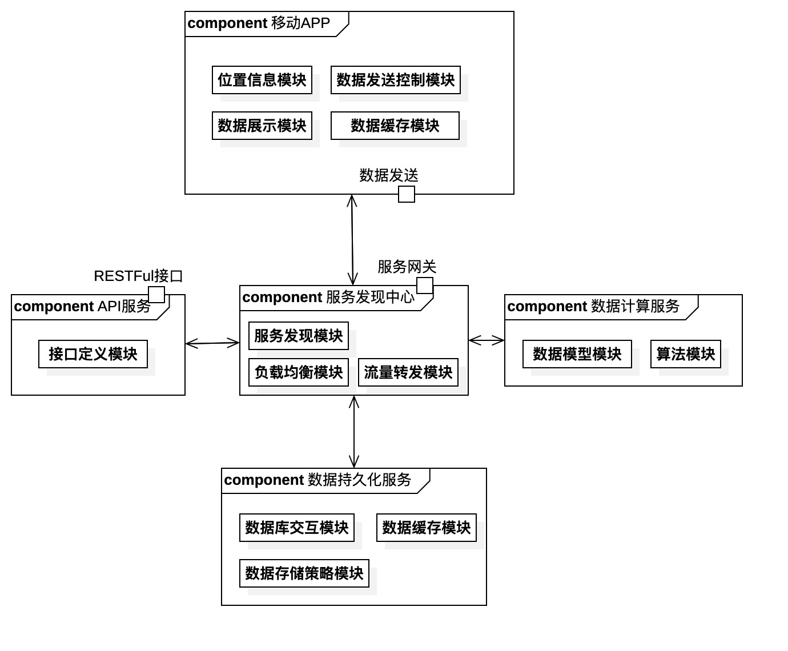

# 基于移动众包的道路流量监测系统可行性分析｜第一版（大纲）

## 综述

1. 改善传统道路监测模式的弊端：高成本的路网监测系统搭建。
2. 本项目融合了**众包**的思想，从用户的移动设备提取位置信息，从而取代了传统的道路监测模式。
3. 为有道路监测需求的机关部门提供一种高可用、高实时、低成本的道路流量监测解决方案。
4. 为市民日常出行的拥堵问题，提供解决方案。

## 系统构架
1. 系统整体采用**C-S模式**的架构
2. 客户端基于移动app的**数据采集**和**数据展示**
3. 服务端采用**微服务架构**，目的如下：
   1. 对于系统**解耦**，提高开发效率
   2. 提高系统整体的性能
   3. 方便以分布式的方式部署，降低服务架设的成本
4. 整体架构展示图
   

## 移动APP
1. 位置信息模块：
   1. 基于外部高德SDK的地图与定位服务调用
   2. 在基本位置信息的基础上，~~提供区块划分的数据服务功能~~（亟待讨论）
  
2. 数据展示模块：
   1. **若无必要，勿增实体**：为用户展示以**用户**为中心，特定半径的圆形区域内的区域拥堵状况。
   2. 提供某区域整体路况（亟待讨论）
3. 数据发送控制模块：
   1. 控制用户设备的数据发送间隔，以控制服务端**负载**
   2. 控制app对于移动设备的性能占用
4. 数据缓存模块：
   1. 以提高用户体验为主，降低用户对于数据展示的等待时间
   
## 服务端
1. API服务
   1. 遵循**RESTFul**标准格式，确保第三方接入的可靠性
   2. 提供详尽的**接口文档**
   3. 用例驱动，**减少冗余**的接口设计
   4. 为API分级，减少破坏性开发过程的出现
   5. **开发前务必与前端商讨好接口格式**
2. SOA
   1. 服务注册发现，微服务的核心调度（Netflix Eureka）
   2. 负载均衡，提高并发，提高系统整体效能
   3. 服务熔断（Hystrix）、降级等非业务化的提高**可用性**的服务模块
   4. 消息队列（以后可能的邮件短信服务）等
3. 持久化
   1. 采用缓存策略，提高系统整体可用性、并发性。
   2. 采用传统的关系型数据库进行存储。
4. 数据计算
   1. 模型的定义
   2. 算法实现
   3. 数据库交互方式（存储策略）

